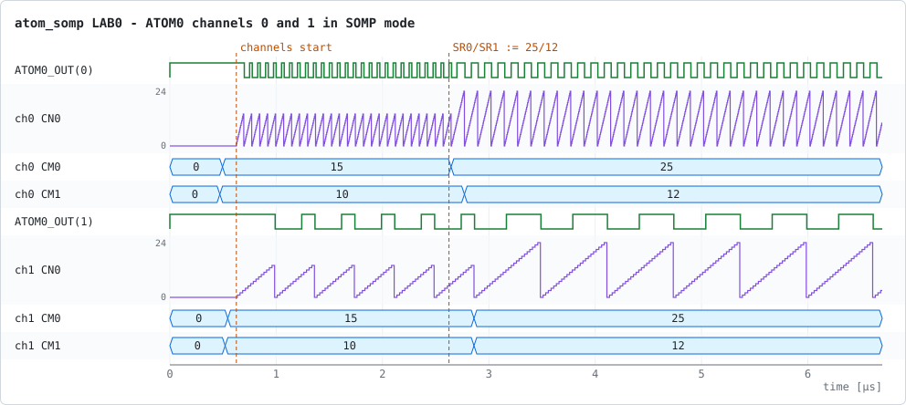
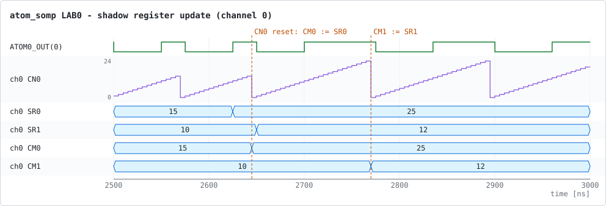
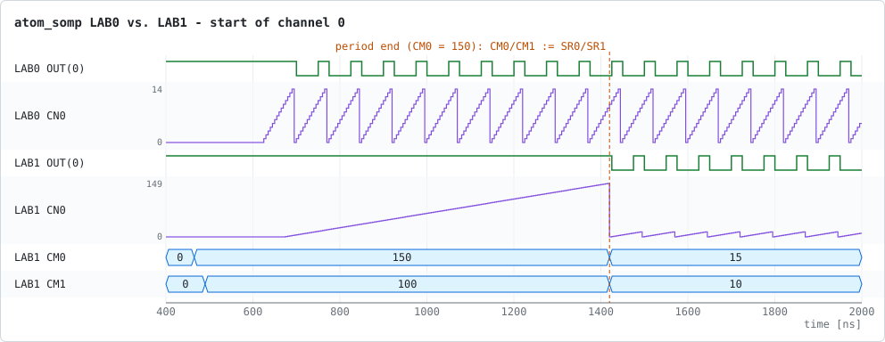

# atom_somp – ATOM PWM generation in SOMP mode

This example recreates the COSIDE example `cos_gtm_example/atom_somp` from the
GTM bundle as a plain SystemC test bench. Two channels of ATOM0 run in
**SOMP** mode (Signal Output Mode PWM). They use different CMU clocks, and
their period and duty cycle are changed at run time through the shadow
registers.

The signal and instance names match the COSIDE example, so the traces can be
compared with the COSIDE waveform layout (see [below](#comparing-with-coside)).

## What the application does

The GTM application ([atom_somp_app.cpp](atom_somp_app.cpp)) runs on the GTM
controller thread. It programs the model through the GAL register structures:

1. Software reset. Cluster 0 is clocked with divider 1 (200 MHz).
2. CMU setup: `CMU_CLK0` = clock / 1 (5 ns tick) and `CMU_CLK1` = clock / 5 (25 ns tick).
3. ATOM0 channel 0 is set to `CMU_CLK0` and channel 1 to `CMU_CLK1`, both in SOMP mode.
   `SR0` = 15 (period) and `SR1` = 10 (duty cycle) are written to both channels.
4. Both outputs are enabled and the channels are started with a host trigger.
5. 2 µs later, the shadow registers are changed to `SR0` = 25 and `SR1` = 12.
   Each channel copies them to its operation registers `CM0`/`CM1` when its
   running period ends.
6. The application waits 4 µs and returns, which ends the simulation.

There are two variants:

| Variant | Option   | Difference                                                   |
|---------|----------|--------------------------------------------------------------|
| LAB0    | –        | Both channels start with period 15, duty cycle 10.           |
| LAB1    | `--lab1` | Channel 0 starts with an initial delay: `CM0` = 150, `CM1` = 100 are written before the channel starts. |

## Test bench

[atom_somp_tb.cpp](atom_somp_tb.cpp) extends `gtm_tb::gtm_harness`, which
provides the GTM model, a 200 MHz clock and a reset released at 12 ns. On top
of that it adds the parts of the COSIDE schematic:

```
                        +---------------------------------+
 i_pwc_src_sc2 -------->| TIM0_IN(5..2)                   |
 i_conv_de1 (bit 7) --->| TIM0_IN(7)       ATOM0_OUT(0)   |---> PWM channel 0
 i_conv_de2 (bit 6) --->| TIM0_IN(1)       ATOM0_OUT(1)   |---> PWM channel 1
                        |                  ATOM0_OUT(7,6) |---> i_conv_de1, i_conv_de2
                        |            i_cos_gtm            |
                        +---------------------------------+
```

* `i_pwc_src_sc2` drives a piecewise-constant pattern onto TIM0 inputs 5..2.
* ATOM0 outputs 7 and 6 are looped back to TIM0 inputs 7 and 1.

The application does not use these connections. They are kept so the netlist
matches the COSIDE example.

## Running

The executable is built into `build/<preset>/examples/atom_somp/`. `ctest`
runs both variants and checks the waveforms:

```bash
ctest --preset linux-release -R atom_somp     # or windows-release
```

To run it by hand:

```bash
cd build/linux-release/examples/atom_somp
./atom_somp --vcd=atom_somp_lab0              # LAB0
./atom_somp --lab1 --vcd=atom_somp_lab1       # LAB1
./atom_somp --help
```

| Option                  | Default                     | Meaning                                                   |
|-------------------------|-----------------------------|-----------------------------------------------------------|
| `--sim_time=<s>`        | `1e-5`                      | Maximum simulation time. The application normally ends the run earlier, at about 6.7 µs. |
| `--lab1`                | off                         | LAB1 variant (initial delay on channel 0).                 |
| `--secondary_variables` | off                         | Also register and trace secondary (internal) GTM variables. |
| `--vcd=<name>`          | `atom_somp_tb_object_trace` | Name of the VCD file, without extension.                   |

The trace contains the GTM controller, the GTM top level, ATOM0 and its
channels 0 and 1, the ATOM0 outputs, the TIM0 inputs and the interrupt
controller.

[check_atom_somp.py](check_atom_somp.py) checks the expected behaviour:

* the register values before and after the update;
* the clock selection;
* the counter step and wrap-around;
* the PWM low and high times;
* the LAB1 initial delay;
* the loop-back from `ATOM0_OUT(7)` to `TIM0_IN(7)`.

## Waveforms

The plots below are rendered from the VCD files that `ctest` writes (see
[Regenerating the plots](#regenerating-the-plots)).

### LAB0 overview



The counter `CN0` of each channel counts CMU clock ticks and wraps at
`CM0` − 1. The output is low from the start of the period until `CN0` reaches
`CM1`, then high until the period ends.

| Channel | Tick  | Before the update (15 / 10)            | After the update (25 / 12)             |
|---------|-------|----------------------------------------|----------------------------------------|
| 0       | 5 ns  | period 75 ns: low 50 ns, high 25 ns    | period 125 ns: low 60 ns, high 65 ns   |
| 1       | 25 ns | period 375 ns: low 250 ns, high 125 ns | period 625 ns: low 300 ns, high 325 ns |

### Shadow register update



`SR0` and `SR1` are written by two separate bus accesses 25 ns apart. For
channel 0, a period ends between the two writes (at 2645 ns):

* at 2645 ns, `CM0` takes the new period (25) but `CM1` keeps the old duty
  cycle (10), so one period is 25 / 10;
* the new duty cycle becomes active at the next period end (2770 ns).

Channel 1 has a longer period, so both registers are written within the same
period and it switches directly to 25 / 12.

### LAB1: initial delay



In LAB1, `CM0` = 150 and `CM1` = 100 are written before the channel starts,
so the first period of channel 0 lasts 150 ticks (750 ns). At its end, the
shadow values 15 / 10 are loaded and the channel continues with the LAB0
waveform, shifted in phase. The update at 2 µs then works the same way as in
LAB0.

See the main [README](../../README.md#differences-to-the-coside-examples) for
the remaining differences to the COSIDE example.

## Regenerating the plots

[doc/plots.json](doc/plots.json) describes the plots: signals, time windows
and markers. [tools/vcd_plot.py](../../tools/vcd_plot.py) renders them from the
VCD files written by `ctest`. Run from the repository root:

```bash
python3 tools/vcd_plot.py examples/atom_somp/doc/plots.json \
        --vcd-dir build/linux-release/examples/atom_somp
```

The model output is identical on Linux and Windows, so either build directory
can be used.

## Origin

The register sequence, instance names and stimuli follow the ATOM SOMP example
of the Bosch GTM SystemC model, which COSEDA Technologies GmbH distributes
under the Apache License 2.0. The code has been restructured and rewritten in
plain SystemC. The expected behaviour comes from the bundle's
"Coside Testcase: ATOM SOMP" description.
