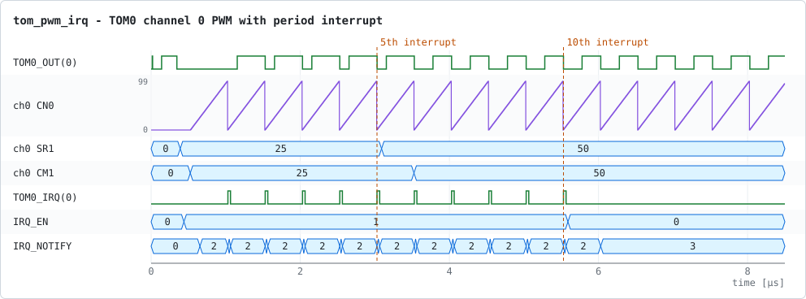
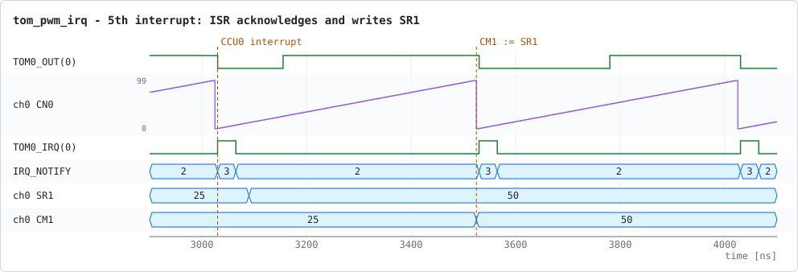

# tom_pwm_irq – TOM PWM with an interrupt service routine

This example, written for this project, shows how the GTM application and its
interrupt service routine (ISR) work together. TOM0 channel 0 generates a PWM
signal and raises an interrupt at the end of every period. The ISR counts the
interrupts and changes the channel configuration at run time.

## What the application does

The application and the ISR are in [tom_pwm_irq_app.cpp](tom_pwm_irq_app.cpp).

**Application** (runs on the GTM controller thread):

1. Software reset. Cluster 0 is clocked with divider 1, and the CMU fixed
   clock `CMU_FXCLK0` is enabled (200 MHz, 5 ns tick).
2. TOM0 channel 0 is configured:
   * clock `FXCLK0`, signal level `SL` = 1;
   * `SR0` = 100 ticks for the period (500 ns);
   * `SR1` = 25 ticks for the duty cycle (125 ns);
   * the CCU0 interrupt is enabled (`IRQ_EN.CCU0TC`: `CN0` reached `CM0`, i.e. the period ended).
3. The channel and its output are enabled and started with a host trigger.
4. The application waits 8 µs and returns, which ends the simulation.

**ISR** (called for each interrupt signalled by the model's interrupt controller):

* It reads `IRQ_NOTIFY` and acknowledges `CCU0TC` by writing it back.
* After the **5th** interrupt it writes `SR1` = 50. The new duty cycle takes
  effect at the next period end.
* After the **10th** interrupt it clears `IRQ_EN`, which disables the interrupt.

## Test bench

The example uses `gtm_tb::gtm_harness` without additions: GTM model, 200 MHz
clock and a reset released at 12 ns. The application and the ISR are passed
in as `params::test_program` and `params::isr_func` ([main.cpp](main.cpp)).

## Running

The executable is built into `build/<preset>/examples/tom_pwm_irq/`. `ctest`
runs it and checks the waveform:

```bash
ctest --preset linux-release -R tom_pwm_irq   # or windows-release
```

To run it by hand:

```bash
cd build/linux-release/examples/tom_pwm_irq
./tom_pwm_irq                    # writes tom_pwm_irq.vcd
./tom_pwm_irq --help
```

| Option           | Default       | Meaning                                                  |
|------------------|---------------|----------------------------------------------------------|
| `--sim_time=<s>` | `1e-5`        | Maximum simulation time. The application normally ends the run earlier, at about 8.5 µs. |
| `--vcd=<name>`   | `tom_pwm_irq` | Name of the VCD file, without extension.                  |

The trace contains TOM0, its channel 0, the `TOM0_OUT(0)` and `TOM0_IRQ(0)`
ports and the interrupt vector of the interrupt controller (`irqs`).

[check_tom_pwm_irq.py](check_tom_pwm_irq.py) checks:

* exactly 10 interrupts, each acknowledged, one per period;
* a PWM period of 500 ns;
* a single change of the low time from 125 ns to 250 ns, after the 5th interrupt;
* each interrupt coincides with the start of a period.

## Waveforms

The plots below are rendered from the VCD file that `ctest` writes (see
[Regenerating the plots](#regenerating-the-plots)).

### Overview



* The counter `CN0` starts at 0.53 µs and wraps every 100 ticks (500 ns).
  The first period end, at 1.03 µs, raises the first interrupt. From then
  on, `TOM0_OUT(0)` follows the PWM pattern. The transitions before 1 µs
  come from reset and configuration.
* In each period the output is low until `CN0` reaches `CM1`, then high:
  low for 125 ns at first and for 250 ns after the duty-cycle change.
* `TOM0_IRQ(0)` pulses once per period. Each pulse ends when the ISR
  acknowledges it.
* After the 10th interrupt (5.53 µs), `IRQ_EN` is 0. The period end still
  sets the notification bit (`IRQ_NOTIFY` = 3 from 6.03 µs), but no interrupt
  is raised and nothing clears the bit.
* `IRQ_NOTIFY` bit 1 (`CCU1TC`: `CN0` reached `CM1`) is set from the first
  period on. It is never enabled or acknowledged, so it stays set.

### 5th interrupt: duty-cycle update



| Time    | Event                                                                                    |
|---------|------------------------------------------------------------------------------------------|
| 3030 ns | The period ends: `CN0` wraps, `IRQ_NOTIFY.CCU0TC` is set and `TOM0_IRQ(0)` goes high.     |
| 3065 ns | The ISR has acknowledged `CCU0TC` and the interrupt line goes low again (35 ns after the interrupt). |
| 3090 ns | The ISR writes `SR1` = 50. The running period still uses `CM1` = 25.                      |
| 3525 ns | At the next period end, `CM1` takes the shadow value 50, so the low time becomes 250 ns.  |

## Regenerating the plots

[doc/plots.json](doc/plots.json) describes the plots: signals, time windows
and markers. [tools/vcd_plot.py](../../tools/vcd_plot.py) renders them from the
VCD file written by `ctest`. Run from the repository root:

```bash
python3 tools/vcd_plot.py examples/tom_pwm_irq/doc/plots.json \
        --vcd-dir build/linux-release/examples/tom_pwm_irq
```
